# Waveshare S3 RLCD-4.2 代码运行与回调流程图

> 配合源码阅读使用。所有行号对应当前仓库 `main/boards/waveshare-s3-rlcd-4.2/` 下的实际位置。
> 本文档使用 Mermaid 8.x 兼容语法（GitHub / VSCode / Typora 均可渲染）。

---

## 0. 阅读路线（先看这个）

按以下顺序读源码，理解曲线最平滑：

| # | 文件 | 看什么 |
|---|---|---|
| 1 | `main/main.cc` | 30 行的入口，看 `app_main()` |
| 2 | `waveshare-s3-rlcd-4.2.cc` 构造函数（行 733） | 板子是怎么"装配"出来的 |
| 3 | `InitializeButtons()`（行 93） | 最简单的回调示例（lambda 捕获 `this`） |
| 4 | `InitializeTools()`（行 257） | **重点**。看 `AddTool()` 的 lambda 签名 |
| 5 | `managers/pomodoro_manager.cc` | 一个完整状态机 + FreeRTOS task 写法 |
| 6 | `data_update_task.cc` | 独立 task + `DisplayLockGuard` 跨线程更新 LVGL |
| 7 | `main/application.cc` | 主循环，和板级代码完全解耦 |

**架构精髓**：板子只负责**注册回调**，不主动驱动主循环。Application 跑事件循环，事件（按键 / MCP 工具调用 / 音频帧）触发时自然调到你在板子构造期挂上去的 lambda。
所以加新功能 = 加 manager + 在 `InitializeTools()` 多注册几个 `AddTool()`。

---

## 1. 整体启动流程（开机 → 进入主循环）

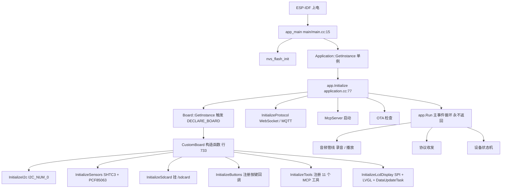

**对照看：**
- `main/main.cc:15` `extern "C" void app_main()`
- `waveshare-s3-rlcd-4.2.cc:733` `CustomBoard::CustomBoard()` —— 6 个 `Initialize*()` 顺序调用
- `waveshare-s3-rlcd-4.2.cc:771` `DECLARE_BOARD(CustomBoard)` —— 把这个类注册成全局 Board

---

## 2. 按键回调链（USER & BOOT）

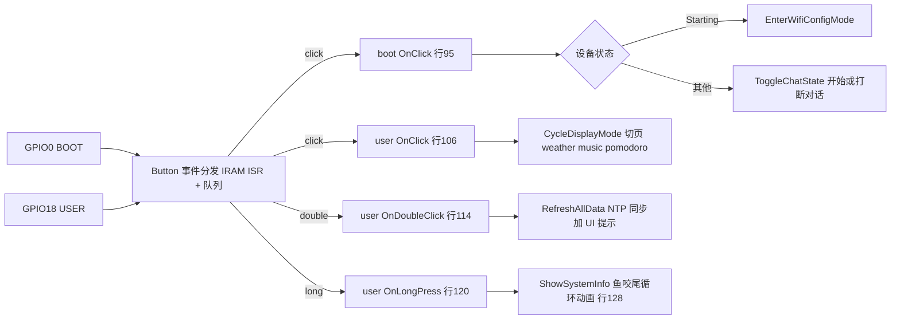

**对照看：** `waveshare-s3-rlcd-4.2.cc:93` `InitializeButtons()` —— 4 个 lambda 全在这里。

---

## 3. AI 调用 MCP 工具的完整链（**最核心的交互**）

以"开始番茄钟 25 分钟"为例，从用户开口到屏幕切页的全过程：

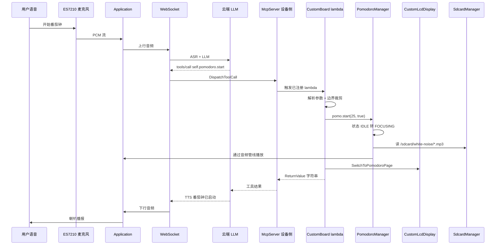

**关键机制：**

```cpp
// AddTool 的签名（伪代码）
mcp_server.AddTool(
    name,                                  // "self.pomodoro.start"
    description,                           // 给 AI 看的中英文用法说明
    PropertyList({...}),                   // 参数 schema (类型/范围/默认值)
    [this](const PropertyList& p) -> ReturnValue { ... }  // 回调
);
```

云端通过 MCP 协议下发 `tools/call`，`McpServer` 根据 name 查表直接调那个 lambda；
lambda 里再操作板载 manager（PomodoroManager / WeatherManager / Memo NVS / Display）。

**11 个工具一览：**

| Tool name | 行号 | 触发的回调动作 |
|---|---|---|
| `self.system.info` | 261 | 读 heap/PSRAM/CPU/电池/WiFi → 返回字符串 |
| `self.weather.update` | 313 | `WeatherManager::set()` → 刷新天气区 |
| `self.disp.network` | 343 | `EnterWifiConfigMode()` |
| `self.disp.switch` | 350 | `display_->SwitchToXxxPage()` |
| `self.pomodoro.start` | 394 | `PomodoroManager::start()` + 切番茄钟页 |
| `self.pomodoro.stop` | 434 | `PomodoroManager::stop()` + 切回天气页 |
| `self.pomodoro.status` | 452 | 返回剩余时间字符串 |
| `self.pomodoro.pause` | 472 | 暂停 / 恢复 |
| `self.memo.add` | 492 | NVS 写入 + UI 刷新（带 HH:MM 校验） |
| `self.memo.list` | 553 | NVS 读取 → 返回带序号列表 |
| `self.memo.done` | 587 | 按 index 删除 |
| `self.memo.clear` | 636 | 清空 |

---

## 4. UI 后台刷新任务（FreeRTOS Task）

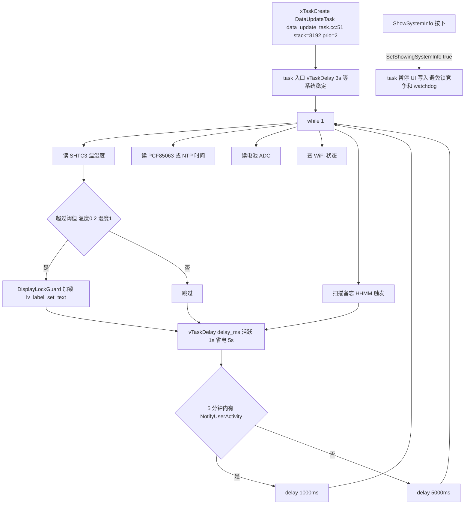

**为什么要加 `DisplayLockGuard`？**
LVGL 不是线程安全的——主循环里有 LVGL tick task，`DataUpdateTask` 是另一个 FreeRTOS task。
两边都要写 widget 时必须先拿同一把互斥锁，否则会造成渲染崩溃 / heap 损坏。

**为什么 `ShowSystemInfo` 要 `SetShowingSystemInfo(true)`？**
长按时主循环正在跑"鱼咬尾"动画（每 30ms 设一次 Y 坐标）。如果此时 `DataUpdateTask` 还在抢锁写文字，
锁等待会触发 task watchdog（默认 5s）。所以临时停掉 task 对 chat_label 的写入。

---

## 5. 回调注册总览（"谁回调谁"一张图记住）

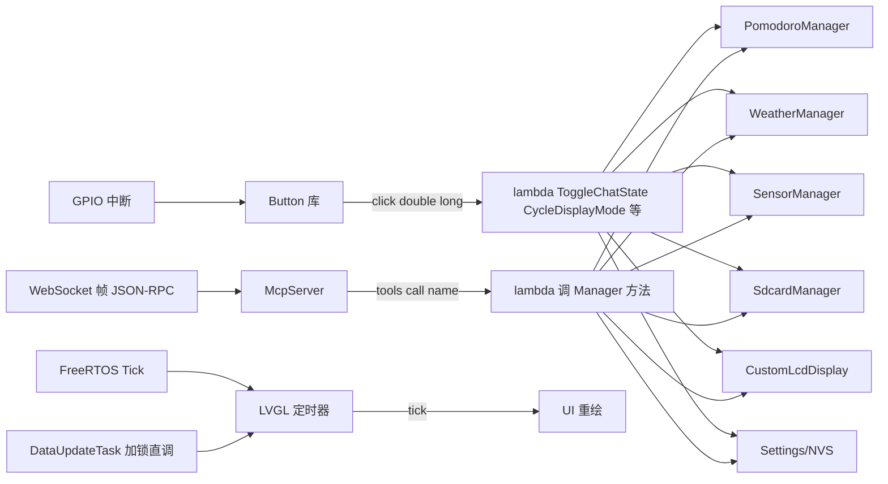

---

## 6. 数据流总览（Sensor / Weather / Memo / Audio）

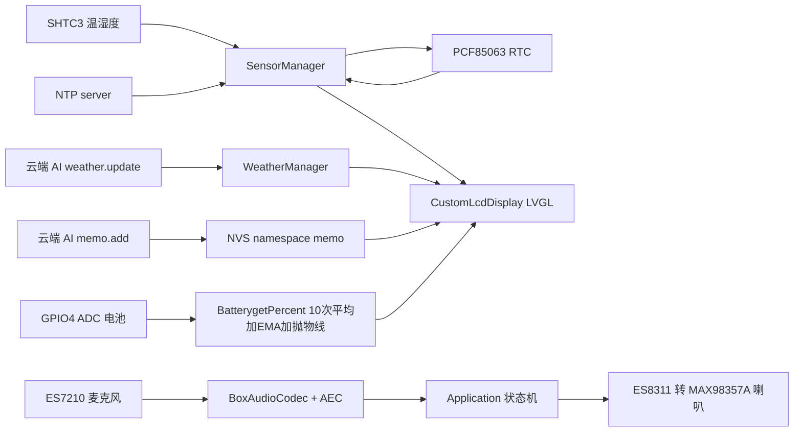

**关键点：**
- 天气**不**由设备主动拉取，由云端 AI 通过 `self.weather.update` 回写——这是这个板子最有意思的设计：把"取数据"的活完全外包给 LLM 的工具链。
- NTP 同步成功后会反向写到 PCF85063，断电也保留时间。
- 备忘录持久化在 NVS，重启不丢。

---

## 7. 番茄钟状态机（PomodoroManager 内部）

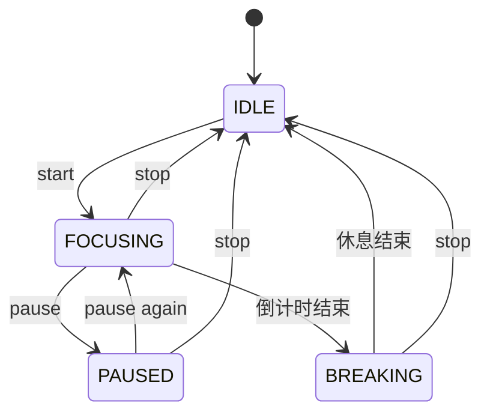

> FOCUSING 状态下：独立 FreeRTOS task 每秒 tick，播放 SD 卡白噪音。

**对照看：** `managers/pomodoro_manager.cc` 的 `start() / stop() / pause() / TimerTask()`。

---

## 8. 配网流程（WiFi 凭据从无到有）

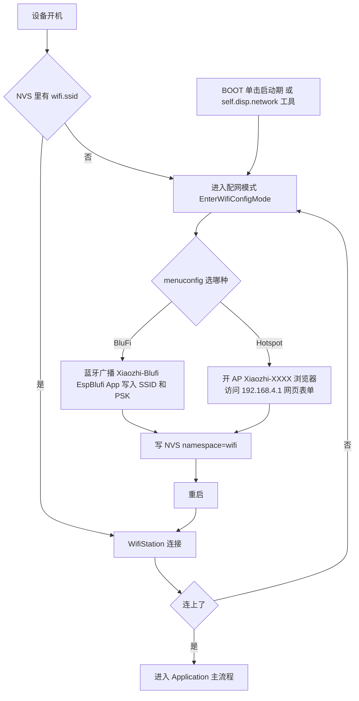

---

## 9. 关键数据结构 / 类层次

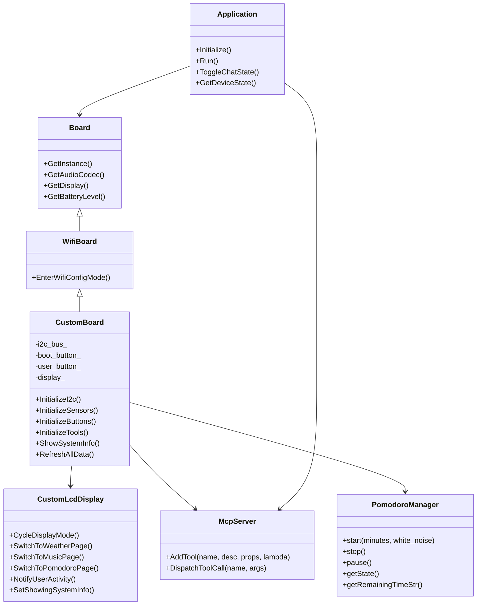

---

## 10. 速查：常用文件 / 关键行号

| 我想看…… | 去哪 |
|---|---|
| 入口 `app_main` | `main/main.cc:15` |
| 板子构造装配 | `waveshare-s3-rlcd-4.2.cc:733` |
| 全局注册 | `waveshare-s3-rlcd-4.2.cc:771` `DECLARE_BOARD` |
| 按键回调 | `waveshare-s3-rlcd-4.2.cc:93` `InitializeButtons()` |
| MCP 工具注册 | `waveshare-s3-rlcd-4.2.cc:257` `InitializeTools()` |
| 系统信息长按动画 | `waveshare-s3-rlcd-4.2.cc:128` `ShowSystemInfo()` |
| 电池电量算法 | `waveshare-s3-rlcd-4.2.cc:704` `BatterygetPercent()` |
| UI 后台 task | `data_update_task.cc:51` `xTaskCreate` |
| LVGL 布局 | `custom_lcd_display.cc` |
| 反射屏 SPI 驱动 | `rlcd_driver.cc` |
| 番茄钟状态机 | `managers/pomodoro_manager.cc` |
| 温湿度 + RTC + NTP | `managers/sensor_manager.cc` |
| Kconfig 注册 | `main/Kconfig.projbuild:320` |
| CMake 路由 | `main/CMakeLists.txt:336` |
| 主循环 | `main/application.cc:181` `Application::Run()` |

---

## 11. 完整调用链总览（三条执行线）

整个系统运行时有 **三条并行执行线**，共同驱动 UI 显示：

### 11.1 启动流程（主任务）

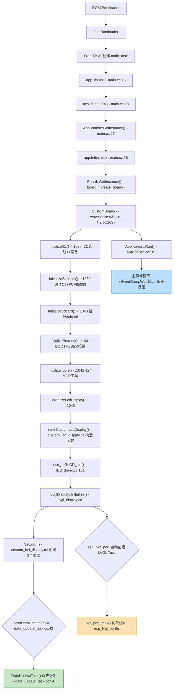

### 11.2 主任务事件循环（优先级 10）

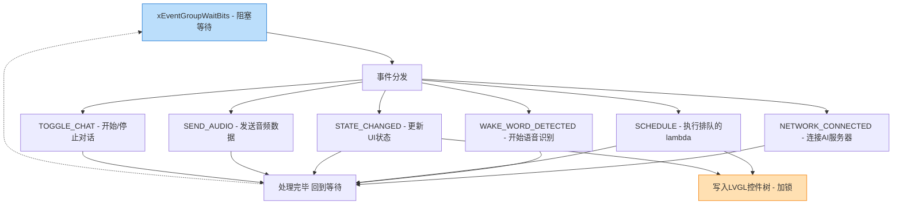

### 11.3 DataUpdateTask 循环（优先级 2）

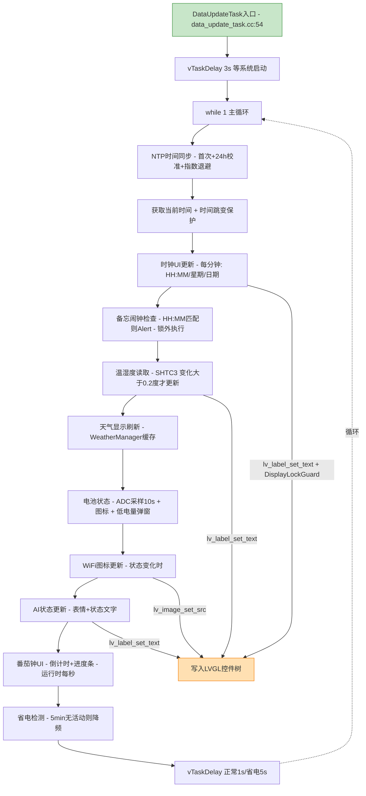

### 11.4 LVGL Task 渲染循环（优先级 4）

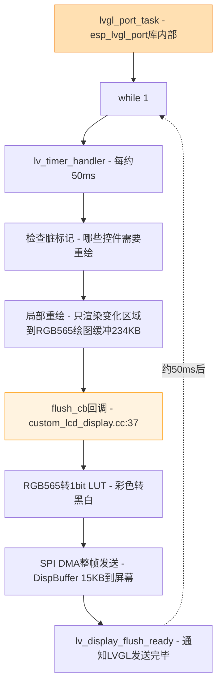

### 11.5 三条线的交互关系

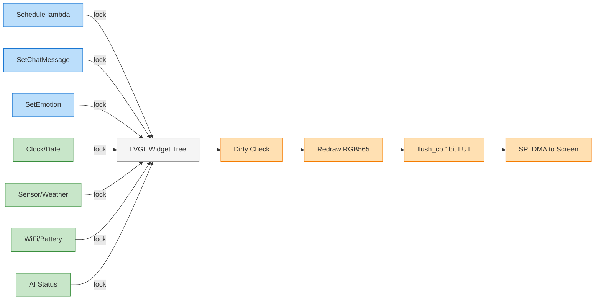

> 蓝色 = 主任务(prio 10)，绿色 = DataUpdateTask(prio 2)，橙色 = LVGL Task(prio 4)，灰色 = LVGL 控件树(内存)

### 三条执行线总结

| 执行线 | 来源文件 | 创建方式 | 优先级 | 职责 | 循环间隔 |
|---|---|---|---|---|---|
| **主任务** | `application.cc:181` | FreeRTOS 默认 main_task | 10 (最高) | AI 对话、网络、语音、事件分发 | 事件驱动(阻塞等待) |
| **DataUpdateTask** | `data_update_task.cc:54` | `xTaskCreate` (板子构造函数中) | 2 (低) | NTP/时钟/天气/传感器/电池/AI状态 | 正常 1s / 省电 5s |
| **LVGL Task** | esp_lvgl_port 库内部 | `esp_lvgl_port_init` | 4 (中) | 脏区检测 → 局部重绘 → flush → SPI | ~50ms |

### 数据流向

```
主任务 (Application)                    DataUpdateTask
    │                                       │
    │ Schedule(SetChatMessage/             │ lv_label_set_text(时钟)
    │          SetEmotion/...)             │ lv_image_set_src(WiFi图标)
    │                                       │ lv_label_set_text(温湿度)
    │                                       │
    ▼                                       ▼
┌─────────────────────────────────────────────┐
│           LVGL 控件树 (内存中)                │
│  ┌─────────┐  ┌─────────┐  ┌──────────┐    │
│  │ 天气页   │  │ 音乐页   │  │ 番茄钟页  │    │
│  │(当前可见) │  │(隐藏)    │  │(隐藏)     │    │
│  └─────────┘  └─────────┘  └──────────┘    │
│                   ↓ 脏标记                   │
└─────────────────────────────────────────────┘
                    │
                    ▼
┌─────────────────────────────────────────────┐
│      LVGL Task (每 ~50ms)                    │
│                                              │
│  脏区检测 → 局部重绘(RGB565) → flush_cb      │
│                    ↓                         │
│  RGB565 → 1-bit LUT → DispBuffer(15KB)      │
│                    ↓                         │
│           SPI DMA → RLCD 屏幕                │
└─────────────────────────────────────────────┘
```

### 线程安全机制

三条线并发访问 LVGL 控件，通过 **DisplayLockGuard** (互斥锁) 保证安全：

```
DataUpdateTask:                    LVGL Task:                 主任务(Schedule):
    │                                  │                          │
    ├─ lock(lvgl_mutex)                │                          │
    ├─ lv_label_set_text(...)          │ (被阻塞)                  │
    ├─ unlock(lvgl_mutex)              │                          │
    │                                  ├─ lock(lvgl_mutex)        │
    │                                  ├─ lv_timer_handler()      │
    │                                  ├─ → flush_cb → SPI        │
    │                                  ├─ unlock(lvgl_mutex)      │
    │                                  │                          ├─ lock(lvgl_mutex)
    │                                  │                          ├─ SetChatMessage(...)
    │                                  │                          ├─ unlock(lvgl_mutex)
```

> **关键点**：任何时刻只有一条线能操作 LVGL 控件。LVGL 本身不是线程安全的，全靠这把锁。

---

**最后更新：** 2026-04-21
